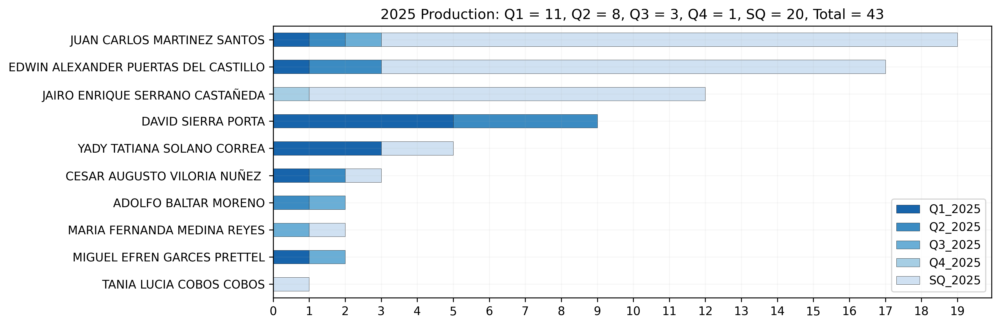
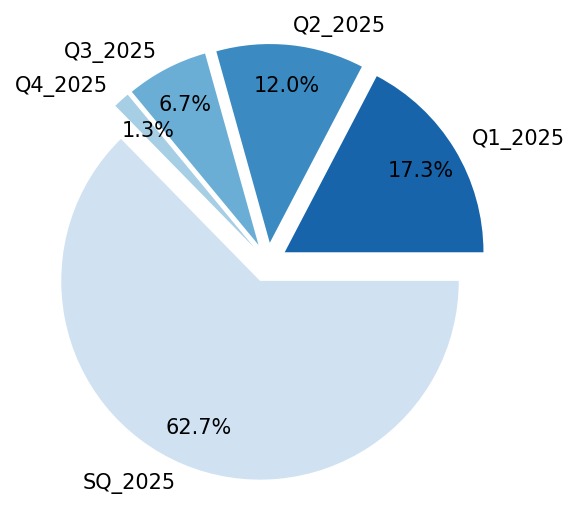
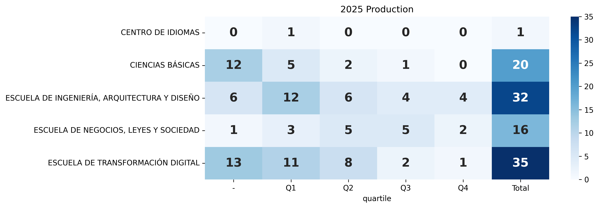
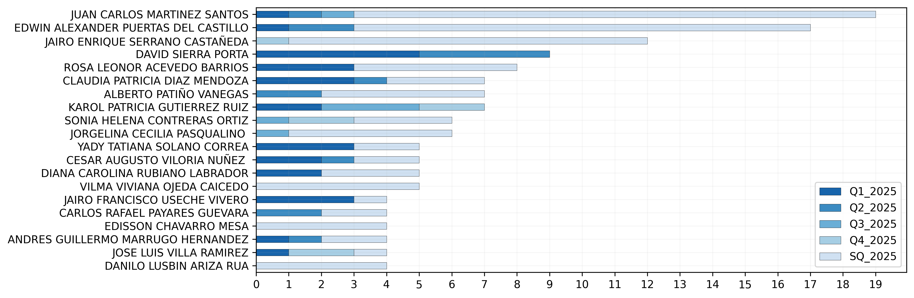
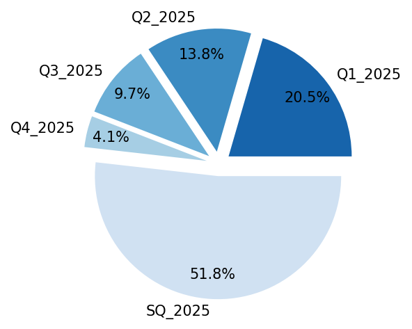

**Desarrollado por:** D. Sierra-Porta (UTB)

# Scopus Metrics UTB
Este repositorio contiene un **notebook/algoritmo** que consolida **tablas resumen de productividad científica** de investigadores de la Universidad, a partir de registros bibliométricos y su **clasificación por cuartil** (**Q1, Q2, Q3, Q4**) y/o **Sin Cuartil (SQ)**.

**Última actualización de estadísticas:** **2025-12-29**.

---

## Objetivo
Generar de forma reproducible un conjunto de **indicadores descriptivos** que permitan:
- resumir la **producción anual** por investigador y por unidad académica;
- comparar la distribución de publicaciones por cuartiles (Q1–Q4) y **Sin Cuartil (SQ)**;
- producir visualizaciones estandarizadas (gráficas y heatmaps) para reportes internos y análisis exploratorio.

> Nota: este repositorio apunta a **resumen estadístico y visualización**, no a evaluación individual de desempeño ni a ranking normativo.

---

## Definiciones usadas
- **Q1–Q4:** cuartil asignado a la revista (según la fuente de cuartiles integrada en el dataset).
- **SQ (Sin Cuartil):** publicaciones sin cuartil asignado o no clasificadas en el esquema Q1–Q4.
- **Total:** suma anual de publicaciones consideradas por el algoritmo, según reglas de filtrado/limpieza.

---

## Flujo metodológico
1. **Ingesta de datos:** lectura del dataset bibliométrico y tablas auxiliares (p. ej. unidades académicas, investigadores, cuartiles).
2. **Normalización:** estandarización de nombres (autores/investigadores), años, afiliaciones y categorías.
3. **Clasificación:** asignación de cada registro a **Q1, Q2, Q3, Q4 o SQ**.
4. **Agregación:** cómputo de tablas resumen por:
   - investigador (totales y desglose por cuartil),
   - unidad académica,
   - periodo (año, trimestre si aplica).
5. **Visualización:** generación automática de figuras y tablas para consulta rápida.

---

## Resultados destacados (2025)
A continuación se muestran ejemplos de salidas del pipeline (figuras exportadas por el notebook).  
Estas visualizaciones están pensadas para responder preguntas como:

- ¿Cómo se distribuye la producción anual por cuartil?
- ¿Qué unidades académicas concentran mayor volumen total?
- ¿Cómo se comporta el patrón Q1–Q4 vs SQ por investigador?

---

# Figuras
**Las siguientes son estadísticas actualizadas al 2025-Dec-29.**

## Escuela de Transformación Digital
### Producción Intelectual SCOPUS - Todos los cuartiles - top 20 de investigadores (Año 2025)
Gráfico de barras horizontales apiladas que resume la producción anual por investigador, desagregada por cuartil de la revista (**Q1, Q2, Q3, Q4**) y por **Sin Cuartil (SQ)**. Cada barra corresponde a un investigador y su longitud total representa el número total de publicaciones consideradas en 2025; los segmentos coloreados indican la contribución en cada categoría. En el agregado de la Escuela para 2025 se contabilizan **45** publicaciones: **Q1 = 12 (26.7%)**, **Q2 = 8 (17.8%)**, **Q3 = 4 (8.9%)**, **Q4 = 1 (2.2%)** y **SQ = 20 (44.4%)**.  
*Nota:* **SQ** agrupa registros sin cuartil asignado o sin información disponible en la fuente de clasificación; su valor puede reflejar tanto producción en fuentes no cuartilizadas como vacíos de metadatos que conviene depurar/actualizar.

### Composición totales de producción por cuartil (Año 2025)
Gráfico circular que muestra la **proporción relativa** de publicaciones de la Escuela en 2025 según el cuartil de la revista (**Q1–Q4**) y la categoría **Sin Cuartil (SQ)**. Para 2025, la distribución porcentual es: **SQ = 62.7%**, **Q1 = 17.3%**, **Q2 = 12.0%**, **Q3 = 6.7%** y **Q4 = 1.3%**.  
*Nota:* **SQ** agrupa registros sin cuartil asignado o sin información disponible en la fuente de clasificación; su proporción puede disminuir al actualizar metadatos y reglas de emparejamiento con listados de cuartiles.

## Toda la Universidad
### Producción Intelectual SCOPUS - Toda la Universidad (Año 2025)
Mapa de calor que resume, para cada unidad académica, el **conteo de publicaciones** clasificadas por cuartil (**Q1–Q4**) y **Sin Cuartil (SQ)** durante 2025. Cada celda muestra el número de publicaciones en la categoría correspondiente; la columna **Total** presenta la suma anual por unidad y la intensidad del color refleja el volumen relativo (mayor intensidad = mayor producción). Esta visualización facilita la comparación transversal entre unidades, identificando (i) el **tamaño total de la producción** y (ii) el **perfil de cuartiles** (proporción relativa de Q1–Q4 vs SQ) asociado a cada unidad.  
*Nota:* la categoría **SQ** agrupa registros sin cuartil asignado o sin información disponible en la fuente de clasificación; diferencias en SQ pueden deberse tanto a patrones reales de publicación como a variaciones en cobertura/calidad de metadatos entre unidades.

### Composición totales de producción - Toda la Universidad - top 20 de investigadores (Año 2025)
Gráfico circular que resume la **proporción relativa** de publicaciones institucionales en 2025 según el cuartil de la revista (**Q1–Q4**) y la categoría **Sin Cuartil (SQ)**. Los porcentajes muestran el peso de cada categoría dentro del total anual y permiten una lectura rápida del balance entre producción en revistas cuartilizadas (Q1–Q4) y registros clasificados como SQ.  
*Nota:* **SQ** agrupa publicaciones sin cuartil asignado o sin información disponible en la fuente de clasificación; su magnitud puede reflejar tanto patrones reales de publicación como vacíos/actualizaciones pendientes de metadatos.

### Composición totales de producción por cuartil - Toda la Universidad (Año 2025)
Gráfico de barras horizontales apiladas que presenta, para cada investigador, el **conteo de publicaciones** en 2025 desagregado por cuartil (**Q1, Q2, Q3, Q4**) y **Sin Cuartil (SQ)**. La **longitud total** de cada barra representa la producción total anual del investigador, mientras que los segmentos coloreados describen su **perfil de cuartiles**. Esta figura facilita la identificación de (i) investigadores con mayor volumen total y (ii) patrones diferenciales de publicación (mayor proporción en Q1–Q2 vs predominio de SQ, etc.).  
*Nota:* la interpretación comparativa debe considerar posibles diferencias disciplinarias y la cobertura/actualización de metadatos de cuartil.

